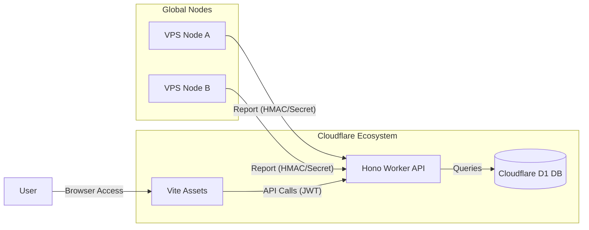

# ⚡️ MiPulse - 全球监控新纪元


> **MiPulse** 是一款基于 Cloudflare 生态系统（Hono + D1 + Workers with Assets）构建的高性能、极简风格 VPS 探针监控系统。它专为追求极致性能与现代审美且无需复杂服务器配置的用户设计。

---

## ✨ 核心特性

- **🚀 全栈 Cloudflare 驱动**: 利用 Workers with Assets 架构，实现 API 与静态资源的高速全球分发。
- **💎 极简美学设计**: 采用玻璃拟态（Glassmorphism）风格，配备动态数据可视化图表与平滑动画。
- **📊 实时性能洞察**: CPU 负载、内存占用、磁盘空间以及实时的双向带宽速率监控。
- **🛡️ 节点安全隔离**: 采用基于 JWT 的鉴权机制，探针与管理端通过签名/Secret 安全通信。
- **📉 离线判定与告警**: 毫秒级心跳检测，自动识别离线节点并生成控制台告警。

---

## 🏗️ 架构概览



---

## 🚀 快速开始

根据你的需求选择以下部署方式之一。如果你已经 Fork 了本仓库，**强烈建议使用方式 1** 以获得自动更新能力。

### 1. GitHub CI/CD 自动部署 (Fork 用户推荐 🌟)

这是最专业的方式。关联后，你对仓库的任何 `push` 都会自动触发 Cloudflare 的构建与发布。

1.  **登录 Cloudflare**: 进入 [Workers & Pages](https://dash.cloudflare.com/?to=/:account/workers-and-pages) 控制台。
2.  **创建应用**: 点击 **Create application** -> **Pages** -> **Connect to Git**。
3.  **关联仓库**: 选择你 Fork 后的 `MiPulse` 仓库。
4.  **构建设置**:
    - **Framework preset**: 保持 `None`。
    - **Build command**: `npm run build`
    - **Build output directory**: `dist`
5.  **首次部署后配置资源**:
    - 进入该项目的 **Settings -> Functions -> Bindings**。
    - 在 **D1 database bindings** 中添加 `MIPULSE_DB`。
    - 在 **KV namespace bindings** 中添加 `MIPULSE_KV`。
    - 重新点击 **Deployments -> Retry deployment** 即可完成。

### 2. 本地命令行部署 (全自动脚本)

只需以下 6 步，即可自动在你的 Cloudflare 账户中完成所有资源创建与部署：

```bash
# 1. 克隆仓库 (Fork 用户请替换为自己的 URL)
git clone https://github.com/imzyb/MiPulse.git

# 2. 进入项目目录
cd MiPulse

# 3. 将 wrangler 更新到最新版
npm install wrangler@latest --save-dev

# 4. 安装项目依赖
npm install

# 5. 登录 Cloudflare (会弹出浏览器)
npx wrangler login

# 6. 执行全自动部署 (自动创建 D1/KV 并发布)
npm run deploy:full
```

---

### 2. 手动分步部署 (进阶)

如果你希望手动控制资源创建过程：

```bash
npm install
npm run db:create

# 将输出结果中的 database_id 复制到 wrangler.toml 中
# 运行本地与远程初始化
npm run db:init
npm run db:init:remote

npm run deploy
```

---

## 🔐 初始安全配置

系统默认提供了一个初始管理员账号用于首次运行：

- **URL**: `https://<your-worker>.workers.dev/login`
- **用户名**: `admin`
- **密码**: `mipulse-secret`

> [!CAUTION]
> **重要安全性提示**: 登录后，请立即进入 **管理面板 -> 个人资料** 修改默认密码。

---

## 🛠️ 探针部署

在你想监控的 VPS 上运行探针（支持多种客户端，如 MiPulse-Probe）：

```bash
# 通用配置环境变量
export MIPULSE_URL="https://<your-worker>.workers.dev"
export MIPULSE_ID="your-node-id"
export MIPULSE_SECRET="your-node-secret"
```

## 🔄 如何同步更新

当上游仓库有新功能或修复发布时，你可以通过以下方式同步：

1.  **手动同步 (推荐)**: 在你的 Fork 仓库页面点击 `Sync fork` -> `Update branch`。GitHub 会自动合并最新代码，并触发 Cloudflare 的自动构建与部署。
2.  **自动化同步**: 本项目内置了 GitHub Action 脚本。进入你仓库的 `Actions` 选项卡并启用 `Fork Sync` 工作流，系统将每天自动检查并同步上游更新。

## 📜 开源协议

本项目采用 **MIT** 协议开源。

---

<p align="center">Designed with ❤️ by <b>Antigravity</b> (Google Deepmind Team)</p>
