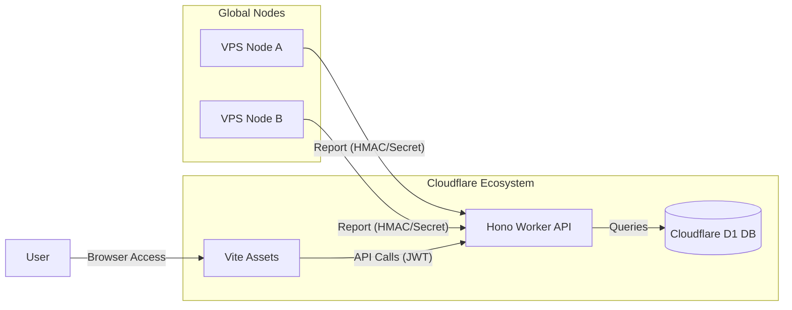

# ⚡️ MiPulse - 全球监控新纪元


> **MiPulse** 是一款基于 Cloudflare 生态系统（Hono + D1 + Workers with Assets）构建的高性能、极简风格 VPS 探针监控系统。它专为追求极致性能与现代审美且无需复杂服务器配置的用户设计。

---

## ✨ 核心特性

- **🚀 全栈 Cloudflare 驱动**: 利用 Workers with Assets 架构，实现 API 与静态资源的高速全球分发。
- **💎 极简美学设计**: 采用玻璃拟态（Glassmorphism）风格，配备动态数据可视化图表与平滑动画。
- **📊 实时性能洞察**: CPU 负载、内存占用、磁盘空间以及实时的双向带宽速率监控。
- **🛡️ 节点安全隔离**: 采用基于 JWT 的鉴权机制，探针与管理端通过签名/Secret 安全通信。
- **📉 离线判定与告警**: 毫秒级心跳检测，自动识别离线节点并生成控制台告警。

---

## 🏗️ 架构概览



---

## 🚀 快速部署 (Quick Start)

根据你的需求选择以下部署方式之一。

### 选项 1：GitHub 一键部署 (最快 🌟)

如果你想最快上线，可以使用 Cloudflare 官方提供的一键部署工具。它会自动克隆项目并引导你完成所有配置：

[](https://deploy.workers.cloudflare.com/?url=https://github.com/imzyb/MiPulse)

1. 点击上方按钮，授权 GitHub 并选择你的账户。
2. 按照向导提示创建 **D1 数据库** 和 **KV 命名空间** (系统会自动为您识别 ID)。
3. 部署完成后，在 Cloudflare 控制台即可看到你的监控站点。

---

### 选项 2：本地命令行部署 (全自动)

MiPulse 提供了全自动化的资源开通与部署脚本，适合需要本地控制或二次开发的用户：

```bash
# 1. 克隆仓库
git clone https://github.com/imzyb/MiPulse.git
cd MiPulse

# 2. 安装项目依赖
npm install

# 3. 登录 Cloudflare (仅需一次)
npx wrangler login

# 4. 全自动部署 (自动创建 D1/KV 并初始化数据库)
npm run deploy
```

> [!TIP]
> 运行 `npm run deploy` 后，脚本会自动检测你的账户。如果没有 `MIPULSE_DB` 或 `MIPULSE_KV`，它将自动为你创建、执行数据库初始化（schema.sql）并完成绑定。

---

### 选项 3：针对 Fork 用户的 CI/CD

如果你 Fork 了本项目并希望通过 GitHub Actions 实现自动化运维：

1. 在你的 GitHub 仓库 `Settings > Secrets and variables > Actions` 中添加一个 **New repository secret**：
   - 名称：`CLOUDFLARE_API_TOKEN`
   - 值：通过 [Cloudflare Dash](https://dash.cloudflare.com/profile/api-tokens) 创建的具有 `Edit Workers` 权限的 Token。
2. 之后你对仓库的任何 `push` 都会自动触发 Cloudflare 的构建与发布。

---

## 🔐 初始安全配置

系统默认提供了一个初始管理员账号用于首次运行：

- **URL**: `https://<your-worker>.workers.dev/login`
- **用户名**: `admin`
- **密码**: `mipulse-secret`

> [!CAUTION]
> **重要安全性提示**: 登录后，请立即进入 **管理面板 -> 个人资料** 修改默认密码。

---

## 🛠️ 探针部署

在你想监控的 VPS 上运行探针（支持多种客户端，如 MiPulse-Probe）：

```bash
# 通用配置环境变量
export MIPULSE_URL="https://<your-worker>.workers.dev"
export MIPULSE_ID="your-node-id"
export MIPULSE_SECRET="your-node-secret"
```

## 🔄 如何同步更新

当上游仓库有新功能或修复发布时，你可以通过以下方式同步：

1.  **手动同步 (推荐)**: 在你的 Fork 仓库页面点击 `Sync fork` -> `Update branch`。GitHub 会自动合并最新代码，并触发 Cloudflare 的自动构建与部署。
2.  **自动化同步**: 本项目内置了 GitHub Action 脚本。进入你仓库的 `Actions` 选项卡并启用 `Fork Sync` 工作流，系统将每天自动检查并同步上游更新。

## 📜 开源协议

本项目采用 **MIT** 协议开源。

---

<p align="center">Designed with ❤️ by <b>Antigravity</b> (Google Deepmind Team)</p>
