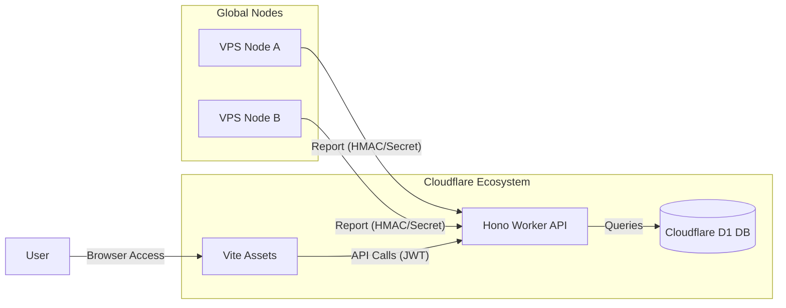

# ⚡️ MiPulse - 全球监控新纪元


> **MiPulse** 是一款基于 Cloudflare 生态系统（Hono + D1 + Workers with Assets）构建的高性能、极简风格 VPS 探针监控系统。它专为追求极致性能与现代审美且无需复杂服务器配置的用户设计。

---

## ✨ 核心特性

- **🚀 全栈 Cloudflare 驱动**: 利用 Workers with Assets 架构，实现 API 与静态资源的高速全球分发。
- **💎 极简美学设计**: 采用玻璃拟态（Glassmorphism）风格，配备动态数据可视化图表与平滑动画。
- **📊 实时性能洞察**: CPU 负载、内存占用、磁盘空间以及实时的双向带宽速率监控。
- **🛡️ 节点安全隔离**: 采用基于 JWT 的鉴权机制，探针与管理端通过签名/Secret 安全通信。
- **📉 离线判定与告警**: 毫秒级心跳检测，自动识别离线节点并生成控制台告警。

---

## 🏗️ 架构概览



---

---

## 🚀 快速部署 (Quick Start)

根据你的需求选择以下部署方式之一。我们强烈推荐使用 **选项 0** 以获得最快、最自动化的体验。

### 选项 0：一键直接部署 (最推荐 🚀)

如果你想跳过所有配置步骤，直接点击下方按钮。它将引导你自动创建所有必要的 Cloudflare 资源（D1, KV）并完成初始部署。

[](https://deploy.workers.cloudflare.com/?url=https://github.com/imzyb/MiPulse)

1. 点击上方按钮。
2. 按照页面提示授权并创建 **D1 数据库** (MIPULSE_DB) 和 **KV 命名空间** (MIPULSE_KV)。
3. 部署完成后，系统将自动进入运行状态。

---

### 选项 1：GitHub 关联部署 (标准集成 🌟)

如果你 Fork 了本项目，推荐使用 Cloudflare 控制台的 "Connect to Git" 功能。这是最标准且支持自动更新的方式：

1.  **登录 Cloudflare**: 进入 [Workers & Pages](https://dash.cloudflare.com/?to=/:account/workers-and-pages) 控制台。
2.  **创建应用**: 点击 **Create application** -> **Workers** -> **Connect to Git**。
3.  **关联仓库**: 选择你 Fork 后的 `MiPulse` 仓库。
4.  **构建设置**:
    - **Build command**: `npm run build`
    - **Build output directory**: `dist` (或保持默认)
5.  **配置资源 (重要)**:
    - 第一次部署完成后，由于未绑定资源，应用可能会报错。
    - 进入该项目的 **Settings -> Bindings**。
    - 在 **D1 database bindings** 中点击 **Add binding**：名称填 `MIPULSE_DB`，并选择你创建的 D1 数据库。
    - 在 **KV namespace bindings** 中点击 **Add binding**：名称填 `MIPULSE_KV`，并选择你创建的 KV 命名空间。
    - 重新点击 **Deployments -> Retry deployment**。
6.  **初始化数据库**:
    - 绑定成功后，你需要运行一次建表脚本。在你的本地终端运行：
        ```bash
        npm run db:init:remote
        ```

---

### 选项 2：本地命令行部署 (全自动)

MiPulse 提供了全自动化的资源开通与部署脚本，适合需要本地控制或二次开发的用户：

```bash
# 1. 克隆仓库
git clone https://github.com/imzyb/MiPulse.git
cd MiPulse

# 2. 安装项目依赖
npm install

# 3. 登录 Cloudflare (仅需一次)
npx wrangler login

# 4. 全自动部署 (自动识别并创建 D1/KV)
npm run deploy
```

> [!TIP]
> 运行 `npm run deploy` 后，脚本会自动检测你的账户并获取正确的 ID。如果没有对应资源，它将自动为你创建并完成本地 `wrangler.local.toml` 的配置。

---

### 选项 3：针对 Fork 用户的 Actions 自动部署

如果你希望通过 GitHub Actions 实现自动化运维：

1. 在你的 GitHub 仓库 `Settings > Secrets and variables > Actions` 中添加一个 **New repository secret**：
   - 名称：`CLOUDFLARE_API_TOKEN`
   - 值：通过 [Cloudflare Dash](https://dash.cloudflare.com/profile/api-tokens) 创建的具有 `Edit Workers` 权限的 Token。
2. 之后你对仓库的任何 `push` 都会自动触发 Cloudflare 的构建与发布。

---

## 🔐 初始安全配置

系统默认提供了一个初始管理员账号用于首次运行：

- **URL**: `https://<your-worker>.workers.dev/login`
- **用户名**: `admin`
- **密码**: `mipulse-secret`

> [!CAUTION]
> **重要安全性提示**: 登录后，请立即进入 **管理面板 -> 个人资料** 修改默认密码。

---

## 🛠️ 探针部署

在你想监控的 VPS 上运行探针（支持多种客户端，如 MiPulse-Probe）：

```bash
# 通用配置环境变量
export MIPULSE_URL="https://<your-worker>.workers.dev"
export MIPULSE_ID="your-node-id"
export MIPULSE_SECRET="your-node-secret"
```

## 🔄 如何同步更新

当上游仓库有新功能或修复发布时，你可以通过以下方式同步：

1.  **手动同步 (推荐)**: 在你的 Fork 仓库页面点击 `Sync fork` -> `Update branch`。GitHub 会自动合并最新代码，并触发 Cloudflare 的自动构建与部署。
2.  **自动化同步**: 本项目内置了 GitHub Action 脚本。进入你仓库的 `Actions` 选项卡并启用 `Fork Sync` 工作流，系统将每天自动检查并同步上游更新。

## 📜 开源协议

本项目采用 **MIT** 协议开源。

---

<p align="center">Designed with ❤️ by <b>Antigravity</b> (Google Deepmind Team)</p>
