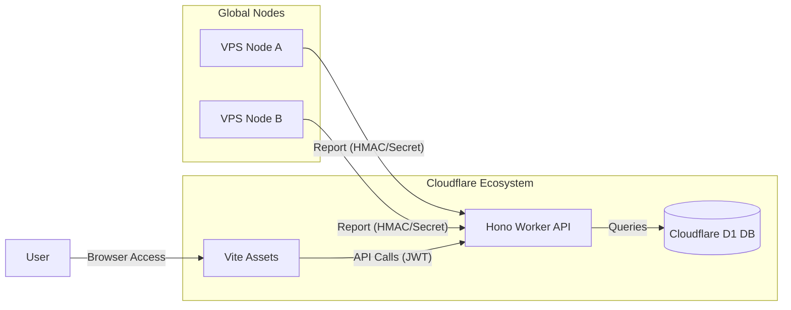

# ⚡️ MiPulse - 全球监控新纪元


[](https://deploy.workers.cloudflare.com/?url=https://github.com/YOUR_USERNAME/MiPulse)

> **MiPulse** 是一款基于 Cloudflare 生态系统（Hono + D1 + Workers with Assets）构建的高性能、极简风格 VPS 探针监控系统。它专为追求极致性能与现代审美且无需复杂服务器配置的用户设计。

---

## ✨ 核心特性

- **🚀 全栈 Cloudflare 驱动**: 利用 Workers with Assets 架构，实现 API 与静态资源的高速全球分发。
- **💎 极简美学设计**: 采用玻璃拟态（Glassmorphism）风格，配备动态数据可视化图表与平滑动画。
- **📊 实时性能洞察**: CPU 负载、内存占用、磁盘空间以及实时的双向带宽速率监控。
- **🛡️ 节点安全隔离**: 采用基于 JWT 的鉴权机制，探针与管理端通过签名/Secret 安全通信。
- **📉 离线判定与告警**: 毫秒级心跳检测，自动识别离线节点并生成控制台告警。

---

## 🏗️ 架构概览



---

## 🚀 快速开始

### 1. 全自动一键部署 (推荐)

只需要登录 Cloudflare，然后运行以下命令，系统将自动创建数据库、KV、更新配置并完成发布：

```bash
# 确保已登录 Cloudflare
npx wrangler login

# 执行全自动部署
npm run deploy:full
```

### 2. 手动分步部署 (进阶)

如果你希望手动控制资源创建过程：

```bash
npm install
npm run db:create

# 将输出结果中的 database_id 复制到 wrangler.toml 中
# 运行本地与远程初始化
npm run db:init
npm run db:init:remote

npm run deploy
```

---

## 🔐 初始安全配置

系统默认提供了一个初始管理员账号用于首次运行：

- **URL**: `https://<your-worker>.workers.dev/login`
- **用户名**: `admin`
- **密码**: `mipulse-secret`

> [!CAUTION]
> **重要安全性提示**: 登录后，请立即进入 **管理面板 -> 个人资料** 修改默认密码。

---

## 🛠️ 探针部署

在你想监控的 VPS 上运行探针（支持多种客户端，如 MiPulse-Probe）：

```bash
# 通用配置环境变量
export MIPULSE_URL="https://<your-worker>.workers.dev"
export MIPULSE_ID="your-node-id"
export MIPULSE_SECRET="your-node-secret"
```

## 📜 开源协议

本项目采用 **MIT** 协议开源。

---

<p align="center">Designed with ❤️ by <b>Antigravity</b> (Google Deepmind Team)</p>
